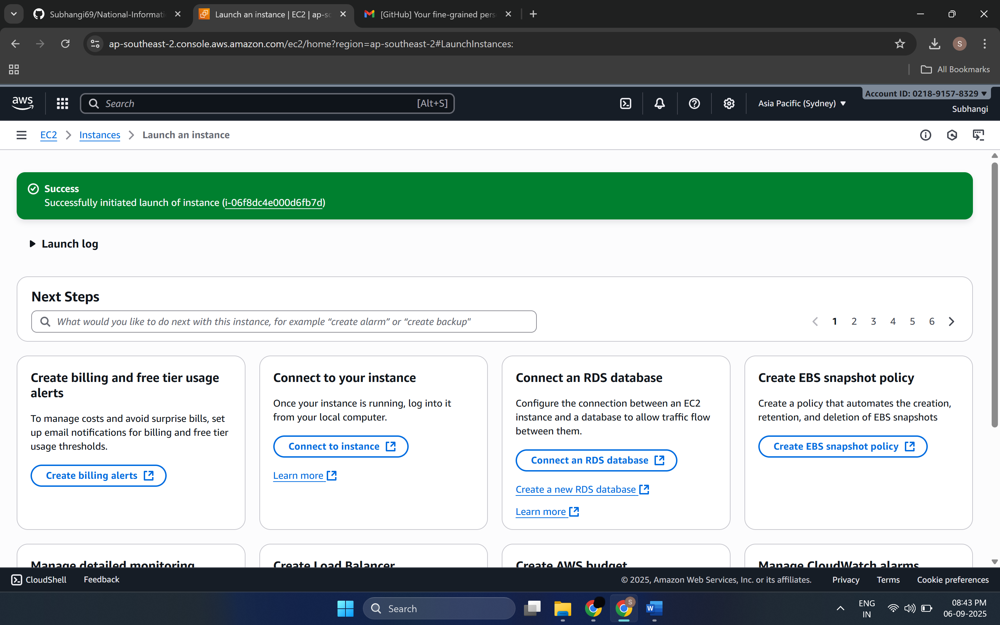
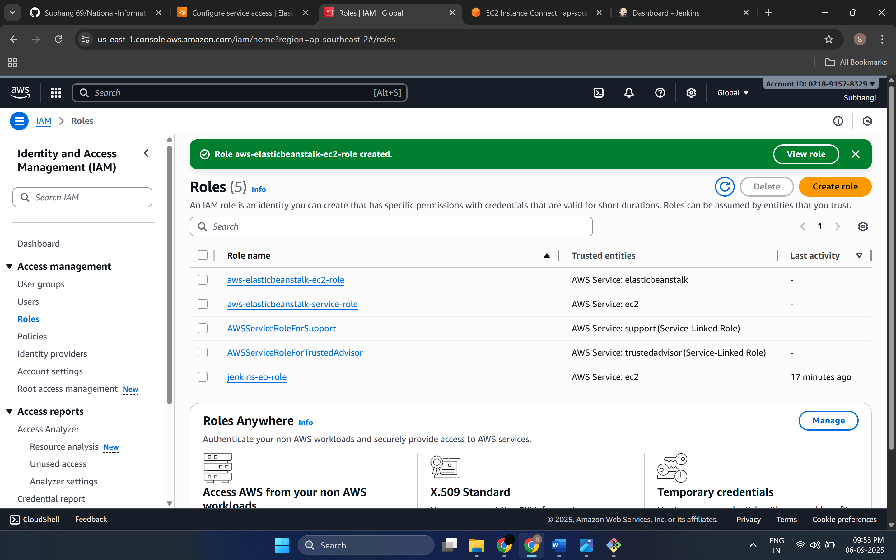
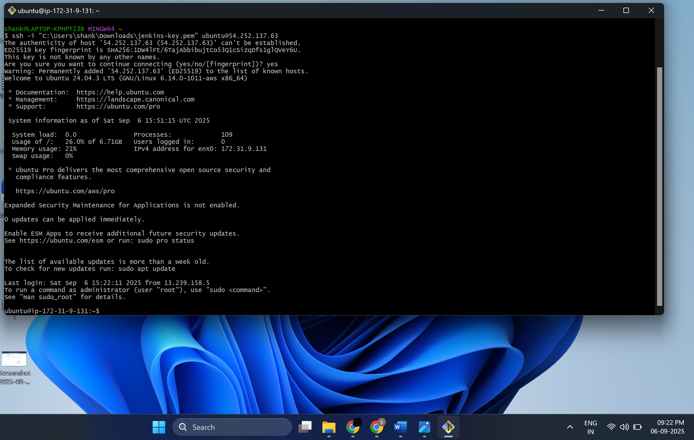
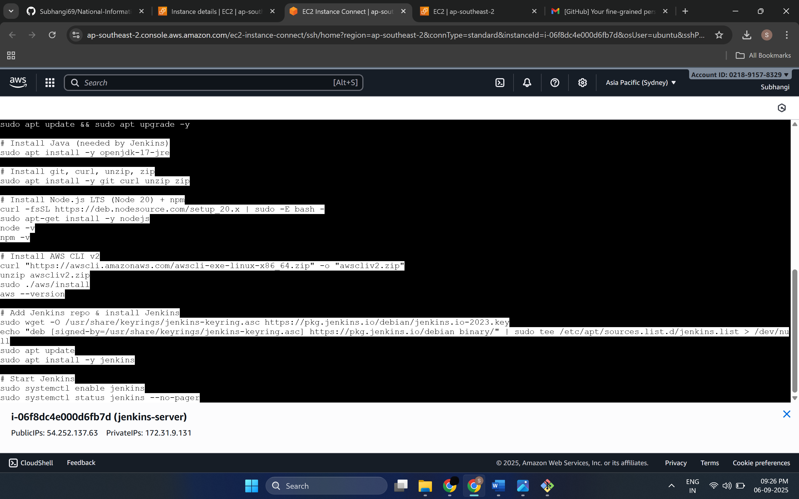
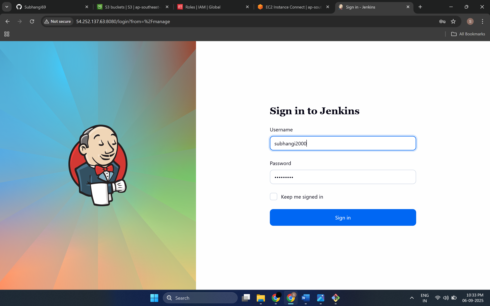
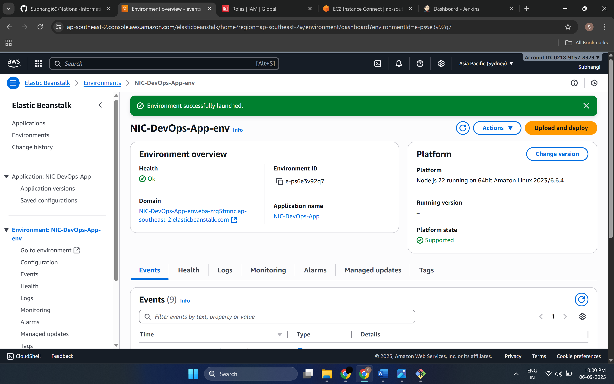
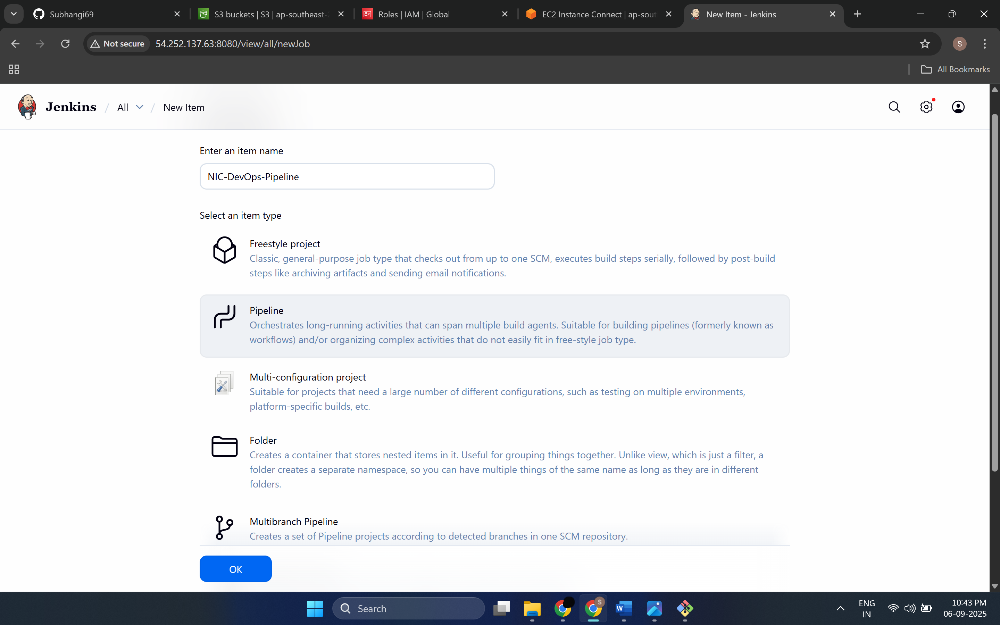
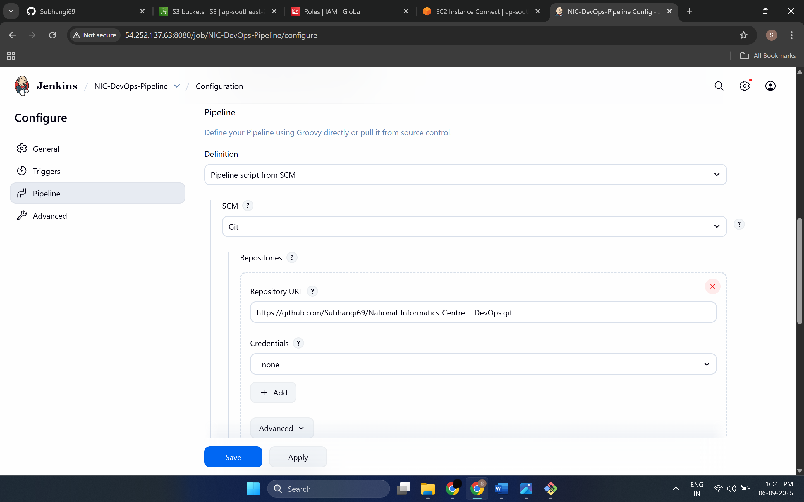
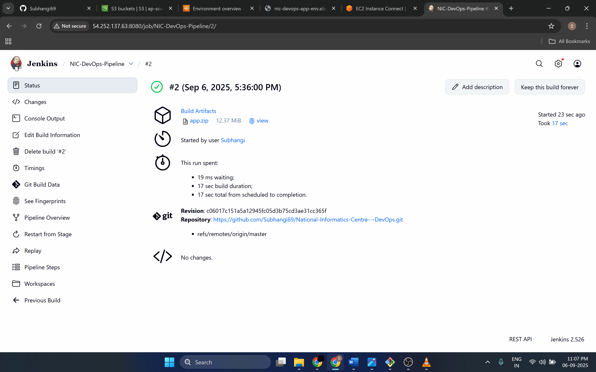

 # 💻 (NIC Internship)

## This project was done to demonstrate Continuous Integration (CI) pipeline using Git, Jenkins and AWS Elastic Beanstalk for deployment of a Node.js based web application
---

## 🏢 Workflow

### 1. **Open AWS Console → EC2 → Launch instance** 



### 2. **IAM → Roles → Create role → EC2 and EB**
   - Attach policies: AmazonS3FullAccess, AWSElasticBeanstalkFullAccess

 

### 3. **Open Security Group:**
   - SSH (22) → your IP 
   - HTTP (80) → 0.0.0.0/0
   - Custom TCP (8080) → 0.0.0.0/0
     


### 4. **Connect to EC2 from laptop using GIT Bash:**
```bash
 ssh -i mykey.pem ubuntu@<EC2_PUBLIC_IP> 
 ```

    
### 5. **Install JAVA, Jenkins, Node.js, AWS CLI**



   
```bash

sudo apt update && sudo apt upgrade -y
sudo apt install -y openjdk-17-jre
sudo apt install -y git curl unzip zip
curl -fsSL https://deb.nodesource.com/setup_20.x | sudo -E bash -
sudo apt-get install -y nodejs
node -v
npm -v
curl "https://awscli.amazonaws.com/awscli-exe-linux-x86_64.zip" -o "awscliv2.zip"
unzip awscliv2.zip
sudo ./aws/install
aws --version
sudo wget -O /usr/share/keyrings/jenkins-keyring.asc https://pkg.jenkins.io/debian/jenkins.io-2023.key
echo "deb [signed-by=/usr/share/keyrings/jenkins-keyring.asc] https://pkg.jenkins.io/debian binary/" | sudo tee /etc/apt/sources.list.d/jenkins.list > /dev/null
sudo apt update
sudo apt install -y jenkins
sudo systemctl enable jenkins
sudo systemctl start jenkins
sudo systemctl status jenkins --no-pager
```

    
### 6. **Access Jenkins.**
   - Get EC2 Public IP from console



      
### 7. **In AWS Console → Elastic Beanstalk → Create Application**  



### 8. **Jenkins job configuration**  
   -  New Item → Pipeline → name NIC-DevOps-Pipeline. 
   - Pipeline script from SCM → Git repo URL [https://github.com/Subhangi69/National Informatics-Centre---DevOps.git](https://github.com/Subhangi69/National-Informatics-Centre---DevOps.git ) → Branch */main → Script path Jenkinsfile. 
    - build trigger: GitHub hook trigger for GITScm polling.




### 9. **Run the pipeline**
   - Click on Build



### 10. **Open the Elastic Beanstalk environment and copy the domain address → Paste in a new tab → opens the App**


---

## 💻 How to Run
 ## Video →
 [](https://youtu.be/_RTMut-4284)

# 🙇‍♂️🙇‍♂️ I have closed the instances to avoid AWS cost  
Therefore, the application is inaccessible right now. Although you can go through my git files suitable to be deployed via Jenkins
